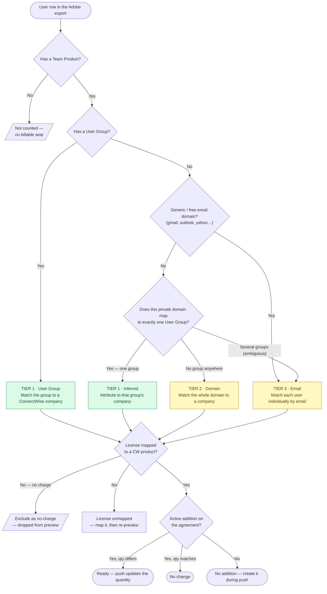

# Adobe Seat Sync

Adobe Seat Sync turns your monthly **Adobe Admin Console user export** into a true-up of ConnectWise agreement addition quantities. You upload the CSV, review a preview of every change, and push the confirmed counts to ConnectWise. Nothing is written until you push.

## How counting works

The Adobe export has **one row per user**, so the sync aggregates it into **per-company, per-product seat counts**:

- A user counts as **one seat for each product** assigned to them (the `Team Products` column).
- A user with no products assigned is **not counted** (no billable seat).
- Counts are **distinct users** — the same person is never counted twice for the same product.

Each row in the preview is therefore one **company × product** with a seat count, ready to compare against the matching ConnectWise agreement addition.

## Recommended: assign every user to a User Group

> **Best practice.** In the Adobe Admin Console, assign every user to a **User Group** named for the customer. This is the most reliable way for the sync to attribute seats to the right ConnectWise company, and it keeps your monthly preview clean with little upkeep.

When a user has a User Group, the sync matches it directly to a company — once. When a user has **no** group, the sync has to fall back to weaker signals (the email domain, then the individual email), which means more rows to map and more month-to-month maintenance. A few minutes spent grouping users in Adobe saves that work every month.

## How users are matched to companies

Each user is matched to a ConnectWise company in **three tiers** — **User Group → Domain → Email**. The sync uses the strongest signal available and only falls back when it has to:

### Tier 1 — User Group (preferred)

The user's Adobe **User Group** is matched to a ConnectWise company. The first time a group is seen, the sync proposes a confident name match (or you pick the company); after that the mapping is saved and reused every month.

The sync also **infers** Tier 1 for a user with no group when their email domain unambiguously belongs to a single known group — e.g. a `@acme.com` user with no group is attributed to the same company as the grouped `@acme.com` users.

### Tier 2 — Domain

If a user has no group **and** their company-owned email domain isn't used by any group, the sync creates one **per-domain** bucket (for example, `acme.com`). Map that domain once and every ungrouped user on it is attributed to the company — and stays mapped next month.

### Tier 3 — Email

Generic or free email domains (gmail, outlook, yahoo, and similar) can't identify a company — so they're never used to group users. Those users, along with users on an ambiguous domain (one that maps to several groups), fall to the **email tier** and are matched **individually**. This avoids ever lumping unrelated people onto one customer, but each address must be mapped on its own — another reason to prefer User Groups.

## License mapping

Each Adobe product (the name before the `(DIRECT - …)` suffix, e.g. **Acrobat Pro**) must be linked to the ConnectWise catalog product that bills those seats. Rows whose license has no mapping show as **License unmapped** and can't be pushed until you map them. Variants like `Acrobat Pro` and `Adobe Acrobat Pro` can each point at the same ConnectWise product.

## No-charge products

Some Adobe products are complimentary (for example, **Complimentary Membership Teams**). Mark these as **no-charge** so their seats are dropped from the preview entirely — never mapped, never billed. Add them from the **No-charge products** card, or use the **Exclude (no charge)** action on any unmapped row.

## Reviewing and pushing

The preview classifies every row so you can see exactly what will change before anything is written:

| Status | Meaning |
| --- | --- |
| **Ready** | Mapped and the quantity differs — the push updates it |
| **No change** | Quantity already matches ConnectWise |
| **No addition** | No line item yet — check the row to create it during the push |
| **Unmatched** | Pick a ConnectWise company for the group, domain, or email |
| **Multiple additions** | The product is billed on more than one agreement — narrow by agreement type or resolve in ConnectWise |
| **License unmapped** | Map the Adobe product to a ConnectWise product (or exclude it) |

Expand any row to see the exact user email addresses behind its count. When you push, creates and quantity updates ship together as a single tracked operation, and each update is re-checked live against ConnectWise before it changes.

## Tips

- **Group users in Adobe** — Tier 1 is the cleanest, most durable match. Domains and emails are fallbacks that need more upkeep.
- **Personal email users** (gmail, etc.) appear as individual rows. Map them one by one, or move them under a customer User Group in Adobe and re-export.
- **Re-run the preview** after mapping a company, license, or no-charge product — the upload stays loaded, so rows reclassify without re-selecting the file.

## Related

- [ConnectWise PSA](/integrations/connectwise) — connect the PSA that holds the agreements
- [Agreement Analysis](/agreements/analysis) — review agreement and addition data
